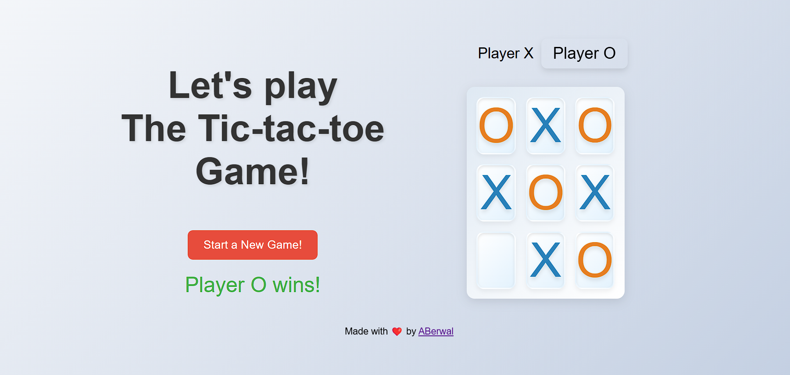
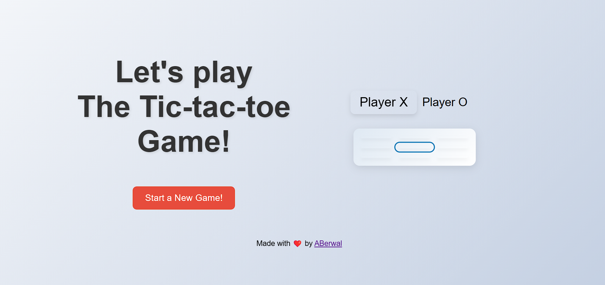
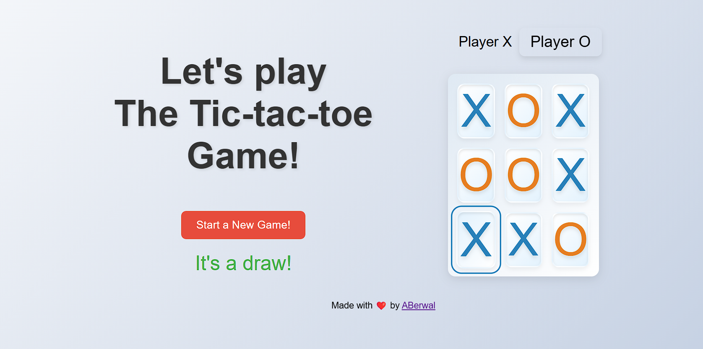

# Responsive Tic-Tac-Toe Game

This project is a responsive Tic-Tac-Toe game built with HTML, CSS, and JavaScript. The game features a sleek, modern design with animations and responsive styles that adapt to various screen sizes, including mobile phones, tablets, laptops, and desktop computers.

## Features

- **Responsive Design**: The game layout adjusts to different screen sizes for optimal user experience on mobile devices, tablets, and desktops.
- **Smooth Animations**: Engaging animations for game elements such as the board tiles, player indicators, and restart button.
- **Stylish Interface**: Modern, gradient backgrounds and hover effects for an attractive look and feel.
- **Winning Message**: Displays a message indicating the winning player or if the game ends in a draw.
- **Restart Button**: Allows players to reset the game and start a new match.

## Installation

1. Clone the repository:
    ```bash
    git clone https://github.com/yourusername/tic-tac-toe.git
    ```
2. Navigate to the project directory:
    ```bash
    cd tic-tac-toe
    ```

## Usage

1. Open the `index.html` file in your preferred web browser:
    ```bash
    open index.html
    ```

2. Play the game by clicking on the tiles to place your moves. The game will automatically switch between players X and O.

3. To restart the game, click the "Start a New Game!" button.

## Customization

You can customize the game by editing the CSS and JavaScript files:

- **CSS**: Modify the styles in `style.css` to change the appearance of the game. You can adjust colors, fonts, sizes, and animations.
- **JavaScript**: Modify the logic in `main.js` to change the game mechanics or add new features.

## Contributing

Contributions are welcome! If you have suggestions for improvements or new features, please submit a pull request or open an issue.

## License

This project is licensed under the MIT License. See the [LICENSE](LICENSE) file for details.

## Acknowledgements

- The project uses [Merriweather Sans](https://fonts.google.com/specimen/Merriweather+Sans) from Google Fonts.
- Inspired by classic Tic-Tac-Toe games and modern web design principles.

## Author

Created by [ABerwal](https://github.com/ajay-berwal).

## Screenshots





Enjoy playing the game!
